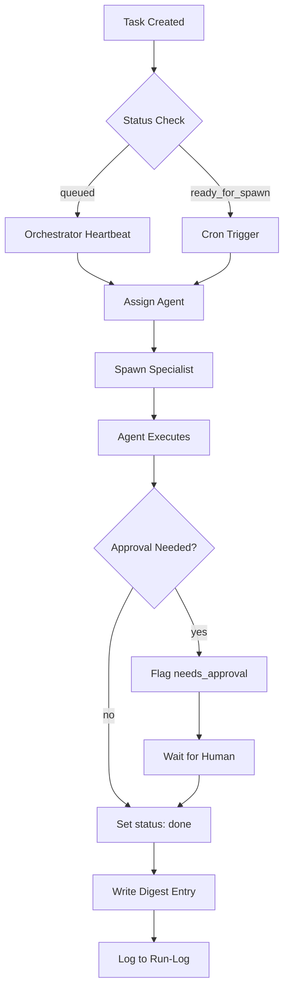

# 🦞 OpenClaw Agent Ecosystem

**An intelligent multi-agent orchestration system for equity research and automated analysis.**

[](LICENSE)
[](https://openclaw.ai)
[](https://openrouter.ai)

---

## 📖 Table of Contents

- [Overview](#overview)
- [Features](#features)
- [Architecture](#architecture)
- [Agent Inventory](#agent-inventory)
- [Installation & Setup](#installation--setup)
- [Usage](#usage)
- [Task Flow](#task-flow)
- [Configuration](#configuration)
- [Security](#security)
- [Troubleshooting](#troubleshooting)
- [Best Practices](#best-practices)
- [Contributing](#contributing)
- [License](#license)

---

## Overview

This workspace contains a sophisticated multi-agent system built on **OpenClaw** for automated equity research, financial analysis, and report generation. The system operates through an orchestration layer that coordinates specialized agents, each optimized for specific analytical tasks.

### Purpose

- **Automated Financial Research**: Generate institutional-grade equity research reports
- **Intelligent Task Orchestration**: Automatically assign, track, and manage analyst tasks
- **Scalable Architecture**: Modular agent design allows easy addition of new capabilities
- **Audit Trail**: Complete task lifecycle tracking with digests and run logs

---

## Features

### 🎯 Core Capabilities

- **Task Queue Management**: Automatic task queuing, assignment, and status tracking
- **Agent Specialization**: 8 domain-specific agents covering full research pipeline
- **Orchestrator System**: Smart task routing with heartbeat-based coordination
- **Output Standardization**: Consistent JSON data blocks for chart generation
- **Approval Workflows**: Built-in human-in-the-loop approval checkpoints

### 🔧 Advanced Features

- **Heartbeat Monitoring**: 30-minute periodic status checks
- **Cron Automation**: Custom scheduling for task dispatch
- **Digest Summaries**: Daily summary of completed work
- **Run Logging**: Detailed execution logs for debugging and auditing

---

## Architecture

### System Flow

```
┌─────────────────┐
│   User Task     │
│  (via Chat/Cron)│
└────────┬────────┘
         │
         ▼
┌─────────────────┐
│   Orchestrator  │ ←── 30-min heartbeat
│  (agent1-orca)  │     + manual triggers
└────────┬────────┘
         │
         ▼ ┌───────────────────────────────────────┐
    Queue │ │ Routing Map                         │
   Tasks  │ │ task_type → assigned_agent          │
└─────┬───┘ └───────────────────────────────────────┘
      │
      ├─────► agent1-macro (Macroeconomics)
      ├─────► agent2-companyresearch (Company Research)
      ├─────► agent3-financials (Financial Modeling)
      ├─────► agent4-esg (ESG Analysis)
      ├─────► agent5-valuation (Valuation)
      ├─────► agent6-risk (Risk Assessment)
      ├─────► agent7-report (Report Writer)
      └─────► agent8-chart (Chart Generation)
```

### Shared Infrastructure

- **`shared/tasks.json`**: Central task queue
- **`shared/routing-map.json`**: Agent assignment rules
- **`shared/digest.md`**: Daily summary of work
- **`orchestrator/workspace/{date}-run-log.md`**: Execution logs

---

## Agent Inventory

| Agent Folder | Name | Responsibilities | Trigger | Output Location |
|--------------|------|------------------|---------|-----------------|
| `agent1-macro` | Macro & Industry Analyst | Macroeconomic analysis, industry overview, Porter's Five Forces | on_demand | `workspace/macro_report_{ticker}_{date}.md` |
| `agent2-companyresearch` | Company Research Analyst | Business model, competitive moat, management assessment | on_demand | `workspace/company_report_{ticker}_{date}.md` |
| `agent3-financials` | Financial Modeler | Historical/forward financials, ratios, DCAT | on_demand | `workspace/financial_model_{ticker}_{date}.json` |
| `agent4-esg` | ESG Analyst | Environmental, social, governance scoring | on_demand | `workspace/esg_report_{ticker}_{date}.md` |
| `agent5-valuation` | Valuation Analyst | DCF, multiples, target price range | on_demand | `workspace/valuation_{ticker}_{date}.json` |
| `agent6-risk` | Risk Analyst | Risk identification, scenario analysis | on_demand | `workspace/risk_assessment_{ticker}_{date}.md` |
| `agent7-report` | Report Writer | Assembles final research report from all outputs | on_demand | `workspace/final_report_{ticker}_{date}.md` |
| `agent8-chart` | Chart Generator | Render charts from JSON data blocks | on_demand | `workspace/charts/{chart_id}.{png|svg}` |
| `orchestrator` | Orchestrator | Task routing, status tracking, heartbeat | cron (30 min) | `workspace/{date}-run-log.md` |

---

## Installation & Setup

### Prerequisites

- **OpenClaw** ≥ 2026.5.0
- **Node.js** ≥ 20.x
- **git** (for version control)
- **Windows Subsystem for Linux (WSL)** or native Windows PowerShell

### 1. Clone Repository

```bash
cd .\openclaw\workspace\main
```

### 2. Verify Configuration

```powershell
openclaw gateway status
```

### 3. Directory Structure Check

Ensure all agent folders exist under `~/.openclaw/agents/`:

```
~/.openclaw/
├── agents/
│   ├── agent1-macro/
│   ├── agent2-companyresearch/
│   ├── agent3-financials/
│   ├── agent4-esg/
│   ├── agent5-valuation/
│   ├── agent6-risk/
│   ├── agent7-report/
│   ├── agent8-chart/
│   ├── main/
│   └── orchestrator/
├── shared/
│   ├── tasks.json
│   ├── routing-map.json
│   └── digest.md
```

### 4. Initialize Shared Files

```bash
# Create if not exists
mkdir ~/.openclaw/shared
mkdir ~/.openclaw/shared

# Initialize empty arrays
echo "[]" > ~/.openclaw/shared/tasks.json
echo "[]" > ~/.openclaw/shared/routing-map.json
echo "# Daily Summary" > ~/.openclaw/shared/digest.md
```

---

## Usage

### Submitting Tasks

You can submit tasks in two ways:

#### 1. Chat with Orchestrator (Recommended)

Simply send a message to the Orchestrator agent:

```
Orchestrator, run a macro analysis for BBCA (banking) as of 2026-05-15.
```

The Orchestrator will:
1. Create a task entry in `shared/tasks.json`
2. Assign it to the appropriate specialist
3. Track progress via `digest.md` and run logs

#### 2. Manual Task Creation

Edit `~/.openclaw/shared/tasks.json` directly:

```json
{
  "id": "task-20260515-001",
  "task_type": "macro_analysis",
  "assigned_to": "agent1-macro",
  "status": "queued",
  "normal_interval_ms": 1800000,
  "needs_approval": false,
  "payload": {
    "ticker": "BBCA",
    "sector": "Banking",
    "report_date": "2026-05-15",
    "specific_instructions": {
      "focus": "banking sector trends"
    }
  }
}
```

Then trigger the Orchestrator:

```powershell
sessions_spawn --task "orchestrator" --runtime subagent --mode run
```

### Monitoring Progress

```bash
# Check task status
cat ~/.openclaw/shared/tasks.json

# View digest summary
cat ~/.openclaw/shared/digest.md

# Check run logs
cat ~/.openclaw/agents/orchestrator/workspace/$(date +%Y-%m-%d)-run-log.md
```

### Output Artifacts

Each specialist agent produces structured outputs:

- **Markdown reports**: `workspace/{agent_type}_{ticker}_{date}.md`
- **JSON data blocks**: For chart generation and API consumption
- **Chart files**: Rendered visualizations in `workspace/charts/`

---

## Task Flow

### Lifecycle States

1. **`queued`**: Task awaits processing
2. **`ready_for_spawn`**: Ready for specialist agent launch
3. **`spawned`**: Agent execution in progress
4. **`in_progress`**: Agent is working
5. **`done`**: Task completed successfully
6. **`needs_approval`**: Requires human review

### Automation Workflow



---

## Configuration

### Heartbeat Settings

Default heartbeat interval: **30 minutes**

To modify:

```bash
# Via gateway config
openclaw gateway config.patch --path heartbeat.interval_ms --value 900000
```

### Cron Jobs

Add custom task dispatch crons:

```json
{
  "action": "add",
  "job": {
    "name": "fast-orc-run",
    "schedule": { "kind": "every", "everyMs": 300000 },
    "payload": {
      "kind": "systemEvent",
      "text": "run orchestrator now"
    },
    "sessionTarget": "main"
  }
}
```

### Model Selection

Override default model:

```bash
openclaw gateway config.patch --path agents.defaults.model --value "moonshot/kimi-k2.6"
```

---

## Security

### API Key Management

All API credentials are stored securely via OpenClaw's internal config system. **Never hardcode keys in agent files.**

### Best Practices

1. **Scan for secrets**: Use `grep -r "api_key" ~/.openclaw/agents/` before sharing code
2. **Use environment variables**: For external service credentials
3. **Enable audit logging**: Monitor all agent executions
4. **Regular backups**: Copy `shared/` and `workspace/` directories monthly

### Permission Levels

| Action | Required Permission |
|--------|--------------------|
| Read agent files | `read` |
| Execute agents | `sessions_spawn` |
| Send external messages | `message:send` |
| Configure gateway | `gateway:admin` |

---

## Troubleshooting

### Common Issues

#### Orchestrator Not Processing Tasks

**Symptoms**: Tasks remain in `queued` state indefinitely

**Solutions**:
1. Verify heartbeat cron is active: `openclaw cron list`
2. Manually trigger: `sessions_spawn --task "orchestrator"`
3. Check task status: Ensure `status: queued` in `tasks.json`

#### Agent Not Spawning

**Symptoms**: `spawned` status but agent doesn't run

**Solutions**:
1. Verify routing map entry exists
2. Check agent folder has `SOUL.md` and `AGENTS.md`
3. Review run logs for error messages

#### Output Files Missing

**Symptoms**: Completed tasks but no output files

**Solutions**:
1. Check workspace permissions on agent directories
2. Verify agent's `AGENTS.md` has proper output paths
3. Ensure agent's SOUL.md defines valid output structure

### Debugging

Enable verbose logging:

```powershell
openclaw gateway config.patch --path agents.verbose --value true
```

Check all recent logs:

```bash
Get-ChildItem -Path ~/.openclaw/agents/*/*/sessions/*.jsonl -Recurse | Select-Object -Last 50
```

---

## Best Practices

### For Task Submission

1. **Be specific**: Include ticker, sector, date, and focus areas
2. **Use consistent naming**: `{YYYY-MM-DD}` dates for easy tracking
3. **Set approval flags**: When human review is needed before proceeding

### For Agent Development

1. **Follow output standards**: Use defined JSON structures for data blocks
2. **Include chart specifications**: Every analytical agent should declare needed visualizations
3. **Document scope**: Clearly state what the agent does AND doesn't do

### For Security

1. **Never share keys**: Use OpenClaw's config system only
2. **Audit regularly**: Run `find . -name "*.json" -exec grep -l "key" {} \;`
3. **Rotate tokens**: For external services used by agents

### For Maintenance

1. **Clean old sessions**: Delete session logs older than 7 days
2. **Update digests**: Merge `digest.md` entries into long-term memory monthly
3. **Monitor costs**: Review token usage in `sessions/.usage-cost-cache.json`

---

## Contributing

### Adding New Agents

1. Create agent folder under `~/.openclaw/agents/`
2. Add `SOUL.md` (agent identity/role)
3. Add `AGENTS.md` (startup instructions, task logic)
4. Add entry to `shared/routing-map.json`
5. Test with a sample task

### Task Flow Guidelines

- Use meaningful `task_type` values (snake_case)
- Include clear `specific_instructions` in task payloads
- Update `AGENT.md` in each agent to reference shared task checks

### Code Style

- **Markdown**: CommonMark compliant
- **JSON**: UTF-8 with trailing commas disabled
- **Comments**: English only, concise explanations

---

## License

Apache License 2.0

See [LICENSE](LICENSE) for full terms.

---

## Quick Reference

| Command | Purpose |
|---------|---------|
| `openclaw cron list` | View all cron jobs |
| `openclaw sessions list` | List all agent sessions |
| `sessions_spawn --task "<task>"` | Force task execution |
| `sessions_send "<message>"` | Send message to specific agent |
| `cat shared/tasks.json` | View current task queue |
| `cat shared/digest.md` | View daily summary |

---

**Built on [OpenClaw](https://openclaw.ai) | Version 2026.5.12**

Last Updated: 2026-05-15

---

*This document serves as both technical documentation and user guide for the OpenClaw agent ecosystem. Update this file as features are added or modified.*
